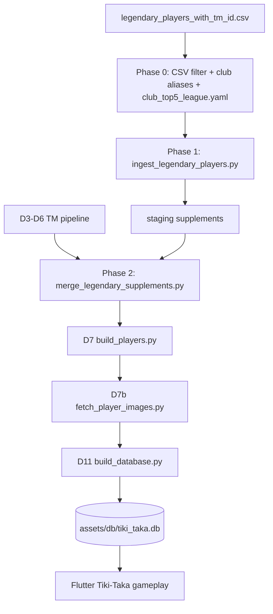

# Legendary Players — Full Implementation Plan

**Goal:** Ship all qualifying legendary players from `legendary-players/legendary_players_with_tm_id.csv` into `assets/db/tiki_taka.db` so **Tiki-Taka mode is playable** with correct attribute intersections (club × nation, club × league, league × nation, etc.) and **Wikidata player images** in search and board cells.

**Source CSV:** `legendary-players/legendary_players_with_tm_id.csv` (336 rows)

**Related docs/code:**
- [dataset-plan.md](../docs/dataset-plan.md) — ETL phases D0–D12
- [tiki-taka-toe-rules.md](../docs/tiki-taka-toe-rules.md) — validation AND rule
- [player-image-plan.md](../docs/player-image-plan.md) — D7b image pipeline
- `tool/etl/build_players.py` — player qualification gate
- `tool/etl/derive_player_league.py` — league edge derivation
- `legendary-players/filter_allowed_attributes.py` — CSV pre-filter

---

## Product Rules (locked for this work)

### 1. Player inclusion gate (matches existing D7)

A legendary player is **included in the database** only when:

```text
COUNT(DISTINCT attribute_id) >= 2
AND at least one edge type ∈ { club, nation, league, pos }
```

| Example | Nation | Club(s) | Qualified? |
| --- | --- | --- | --- |
| Brazilian only | Brazil | — | **No** (1 attribute) |
| São Paulo only | — | São Paulo | **No** (1 attribute — and São Paulo is not allowlisted anyway) |
| Brazilian + São Paulo | Brazil | São Paulo | **Yes** (if São Paulo were allowlisted) |
| Lyon + PSV | — | Lyon, PSV | **Yes** (2 club edges) |
| Brazilian + Leicester City | Brazil | Leicester City | **Yes** |
| Russia only (no clubs) | Russia | — | **No** |

Implementation reference: `tool/etl/build_players.py` lines 45–46, 101–112.

**Do not weaken this gate.** Players who fail it are logged to `legendary-players/reports/excluded_players.json` with reason `insufficient_attributes`.

### 2. Cell validation (runtime — unchanged)

A guess is valid for cell `(row, col)` when the player has **both** attributes independently:

```text
valid(player, row_attr, col_attr) ⇔ edge(player, row_attr) AND edge(player, col_attr)
```

Examples for a Brazilian who played at Leicester City:

| Row | Column | Valid? |
| --- | --- | --- |
| `club:1003` (Leicester City) | `nation:brazil` | Yes |
| `league:GB1` (Premier League) | `nation:brazil` | Yes (if `league:GB1` edge exists via Path B) |
| `club:1003` | `league:GB1` | Yes |

### 3. Dual nationality — Alfredo Di Stéfano (`Argentina / Spain`)

**Special case:** CSV nationality `Argentina / Spain` must emit **two nation edges**:

```text
nation:argentina   source=legendary_citizenship
nation:spain       source=legendary_citizenship
```

- Both edges participate in validation (Di Stéfano validates for Argentina **or** Spain column headers).
- `players.nation` cache column: use **`argentina`** (first listed nation) for display subtitle consistency.
- Do **not** add a synthetic `nation:argentina_spain` slug.
- Nation SVG assets for Argentina and Spain already exist under `assets/tiki_taka/attrs/nations/`.
- Add alias in `tool/etl/config/name_aliases.yaml`:

```yaml
nations:
  "Argentina / Spain": argentina  # resolver fallback only; ingest emits BOTH edges explicitly
```

### 4. League edges for allowlisted clubs (Path B)

Legendary ingest must derive `league:{competition_id}` using the same Path B rule as D4:

```text
player has club:{club_id}
AND club.domestic_competition_id ∈ { GB1, ES1, IT1, L1, FR1 }
→ player gets league:{domestic_competition_id}  source=league_club
```

**New / expanded clubs** (Leicester City, Southampton, Celtic, etc.) must be mapped. Source of truth:

```text
tool/etl/config/club_top5_league.yaml   # NEW — club_id → GB1|ES1|IT1|L1|FR1
```

Generated once from `tool/etl/staging/normalized/clubs.csv` × `clubs_allowlist.yaml`, then hand-verified for the 44 clubs added beyond the original top-league core. Clubs whose domestic league is **not** top-5 (Boca, Santos, Celtic, Galatasaray, …) get **no** `league:*` edge — that is correct.

| Club (display) | club_id | league edge |
| --- | --- | --- |
| Leicester City | 1003 | `league:GB1` |
| Southampton | 180 | `league:GB1` |
| Nottingham Forest | 703 | `league:GB1` |
| Hamburger SV | 41 | `league:L1` |
| FC Köln | 3 | `league:L1` |
| Espanyol | 714 | `league:ES1` |
| Feyenoord | 234 | *(none — Eredivisie)* |
| Santos | 221 | *(none)* |

### 5. Nation allowlist scope — seven nations intentionally excluded

These nationalities are **not** widely used as v1 board headers and must **stay stripped** from the legendary CSV (do **not** add to `nations_allowlist.yaml`, do **not** add flag SVGs):

| Nationality (CSV) | Affected player(s) | Ingest behaviour |
| --- | --- | --- |
| North Macedonia | Darko Pančev | No `nation:*` edge; qualifies via allowlisted clubs |
| Iran | Ali Daei | No `nation:*` edge; qualifies via allowlisted clubs |
| Georgia | Kakha Kaladze | No `nation:*` edge; qualifies via allowlisted clubs |
| Paraguay | José Luis Chilavert | No `nation:*` edge; qualifies via allowlisted clubs |
| Zambia | Kalusha Bwalya | No `nation:*` edge; qualifies via allowlisted clubs |
| South Africa | Lucas Radebe | No `nation:*` edge; qualifies via allowlisted clubs |
| New Zealand | Wynton Rufer | No `nation:*` edge; qualifies via allowlisted clubs |

`filter_allowed_attributes.py` already clears these values from the `Nationality` column. **Do not** add them to `EXCEPTION_NATIONS`. The only nationality exception remains `"Argentina / Spain"` (Di Stéfano dual-nation rule).

These players can still ship if they meet the two-attribute gate via **clubs**, **leagues** (Path B), and/or **position** — e.g. Pančev (Red Star Belgrade + Inter Milan), Daei (Bayern Munich + Al-Shabab). They will not appear on nation-column cells for their home country, which is acceptable for v1.

---

## Current Gap Summary (baseline — re-run after Phase 0)

| Metric | Count | Notes |
| --- | ---: | --- |
| CSV rows | 336 | All have `transfermarkt_id` + `wikidata_qid` |
| Already in shipped DB | ~3 | Maradona-era overlap with TM scrape |
| In TM `normalized/players.csv` | ~102 | Will merge via normal D3–D6 |
| **Not in TM dataset** | **~233** | Require legendary supplement ingest |
| Empty nationality (post-filter) | 3 | In CSV — seven nations stripped by policy (see §5); four TM-unresolved players not in CSV |
| Empty clubs (post-filter) | 7 | Career clubs not in allowlist — see §0.2 |
| Nations stripped by filter | 7 | **Intentional** — do not restore to allowlist |
| Club stints stripped | ~829 | Restored by 100-club allowlist re-filter |

Re-run baseline script before Phase 1:

```powershell
python legendary-players/_gap_analysis.py
python legendary-players/_check_db_gap.py
```

---

## Architecture Overview

```text
Phase 0 — Data prep (CSV, club aliases, club→league map)
    ↓
Phase 1 — ingest_legendary_players.py → staging edge + profile supplements
    ↓
Phase 2 — Merge supplements into D3–D6 staging (before D7)
    ↓
Phase 3 — D7–D7b — players table + Wikidata images
    ↓
Phase 4 — D8–D11 — aliases, pair stats, boards, SQLite export
    ↓
Phase 5 — QA, Flutter tests, gameplay smoke, ship
```



---

## Phase 0 — Data Preparation & Config

**Branch:** `feat/legendary-players-p0-data-prep`

### 0.1 Confirm nation stripping (do not restore seven nations)

**Product decision:** The seven nationalities in [§5](#5-nation-allowlist-scope--seven-nations-intentionally-excluded) are **not** added to the game. No changes to `nations_allowlist.yaml` or nation SVG assets for them.

Actions:

1. Confirm `legendary-players/filter_allowed_attributes.py` does **not** list those seven in `EXCEPTION_NATIONS` (only `"Argentina / Spain"` and the existing v1 exception set remain).
2. Re-run CSV filter:

```powershell
python legendary-players/filter_allowed_attributes.py
```

3. Write `legendary-players/reports/stripped_nations.json` listing the seven players with blank `Nationality` and their remaining allowlisted clubs (for QA).

**Verify:** `_qual_check.json` shows `empty_nat: 3` in the current CSV (three stripped-nation players with TM ids). Four other stripped-nation legends are documented in `stripped_nations.json` but are not in `legendary_players_with_tm_id.csv` (TM id unresolved). Ingest must **not** fail on blank nationality when the player still has ≥2 other attributes.

### 0.2 Fix seven club-less players

These players currently have **only one attribute** (nation) and will be **excluded** unless clubs are added:

| Player | Nation | Missing clubs (not allowlisted) | Recommended action |
| --- | --- | --- | --- |
| Lev Yashin | Russia | Dynamo Moscow | **Manual supplement:** add `tool/etl/config/legendary_club_supplements.yaml` entry if no allowlisted club fits → **exclude** with reason (single-nation GK, no top club in list) |
| Gigi Riva | Italy | Cagliari | Exclude OR add Cagliari to allowlist (out of scope — **exclude**) |
| Hans-Peter Briegel | Germany | Verona (already allowlisted as… check) | Add `club:410` (Udinese) or correct Bundesliga club from research |
| Nándor Hidegkuti | Hungary | MTK Budapest | Exclude (no Hungarian club in allowlist) |
| József Bozsik | Hungary | MTK Budapest | Exclude |
| Valentin Ivanov | Russia | Torpedo Moscow | Exclude |
| Lakhdar Belloumi | Algeria | MC Alger / other | Exclude (no Algerian club in allowlist) |

Create `legendary-players/manual_club_fixes.csv`:

```csv
player_name,transfermarkt_id,club_display_name,club_id,source,notes
Hans-Peter Briegel,71378,<researched club>,...,legendary_manual,...
```

Only add rows where an **allowlisted** club is historically correct. Expected outcome: **~329–331 included**, **~5–7 excluded** (documented).

### 0.3 Club name → club_id alias table

Create `tool/etl/config/legendary_club_aliases.yaml` mapping CSV spellings → `clubs_allowlist.yaml` keys:

```yaml
version: "1"
aliases:
  "Al-Shabab": "Al Shabab"
  Nantes: "FC Nantes"
  Basel: "FC Basel"
  Koln: "FC Köln"
  "Paris SG": "Paris Saint Germain"
  # … full list from filter_allowed_attributes.CLUB_ALIASES + gap report
```

Every club string remaining in the CSV after the allowlist filter must resolve to exactly one `club_id`.

**Verify script** (add in Phase 0):

```powershell
python legendary-players/verify_club_mapping.py
# exits 1 if any CSV club string is unmapped
```

### 0.4 Generate `club_top5_league.yaml`

New file `tool/etl/config/club_top5_league.yaml`:

```yaml
version: "1"
# club_id → top-5 competition_id (Path B league_club)
mapping:
  "1003": GB1   # Leicester City
  "180": GB1    # Southampton
  # … all allowlisted clubs with domestic_competition_id in top-5
```

Generator script: `tool/etl/scripts/generate_club_top5_league.py`

```powershell
python tool/etl/scripts/generate_club_top5_league.py
python tool/etl/scripts/generate_club_top5_league.py --verify
```

**DoD Phase 0:**

- [x] Seven non-allowlisted nations remain stripped; `stripped_nations.json` documents affected players
- [x] `filter_allowed_attributes.py` re-run; `_qual_check.json` shows `empty_nat: 3` (3 of 7 stripped-nation players in CSV)
- [x] `verify_club_mapping.py` passes (0 unmapped clubs in CSV)
- [x] `club_top5_league.yaml` covers every allowlisted club that has a top-5 domestic league (66 mappings)
- [x] `legendary-players/reports/phase0_summary.json` written (counts, excluded players preview)
- [x] `flutter test test/features/tiki_taka/domain/services/tiki_taka_attribute_manifest_test.dart` passes (nation count unchanged)

**Git commit & push:**

```powershell
git add legendary-players/ tool/etl/config/
git commit -m "$( @'
Prep legendary player data: club aliases and top-5 league map.

Keep seven non-v1 nations stripped from the CSV, add club→league mapping for the expanded allowlist, and document players that cannot meet the two-attribute gate.
'@ )"
git push -u origin feat/legendary-players-p0-data-prep
```

---

## Phase 1 — Legendary Ingest Script

**Branch:** `feat/legendary-players-p1-ingest`

### 1.1 Create `tool/etl/ingest_legendary_players.py`

**Inputs:**
- `legendary-players/legendary_players_with_tm_id.csv`
- `tool/etl/config/clubs_allowlist.yaml`
- `tool/etl/config/nations_allowlist.yaml`
- `tool/etl/config/name_aliases.yaml`
- `tool/etl/config/legendary_club_aliases.yaml`
- `tool/etl/config/club_top5_league.yaml`
- `tool/etl/config/legendary_club_supplements.yaml` (manual fixes from 0.2)
- `tool/etl/config/position_map.yaml`

**Outputs** (under `tool/etl/staging/legendary/`):

| File | Contents |
| --- | --- |
| `legendary_player_profiles.csv` | `player_id, display_name, search_text, nation_slug, wikidata_qid` |
| `legendary_player_club.csv` | `player_id, club_id, attribute_id, source=legendary_career` |
| `legendary_player_nation.csv` | `player_id, nation_slug, attribute_id, source=legendary_citizenship` |
| `legendary_player_league.csv` | `player_id, competition_id, attribute_id, source=league_club` |
| `legendary_player_position.csv` | `player_id, position_bucket, attribute_id, source=legendary_profile` |

**Per-row algorithm:**

```python
player_id = tm:{transfermarkt_id}  # numeric id without prefix in CSV

# 1. Nations
if nationality == "Argentina / Spain":
    emit nation:argentina, nation:spain
else:
    slug = resolve_nation(nationality)
    if slug: emit nation:{slug}
    # blank or non-allowlisted nationality → skip nation edge (see §5)

# 2. Clubs (comma-separated Senior Clubs)
for club_name in parse_clubs(row):
    club_id = resolve_club(club_name)
    emit club:{club_id}

# 3. Leagues (Path B from clubs)
for club_id in player_clubs:
    league_id = club_top5_league.get(club_id)
    if league_id: emit league:{league_id}

# 4. Position
bucket = map_position(row["Position"])  # GK|DEF|MID|FWD → pos:gk|def|mid|fwd
if bucket: emit pos:{bucket.lower()}

# 5. Qualification preview (same rules as D7)
if distinct_attributes >= 2: include else log excluded
```

**Important:** Emit supplements for **all** 336 CSV rows regardless of TM overlap. D7 dedupes by `player_id`.

**Position mapping** (legendary CSV uses coarse tokens):

| CSV | `attribute_id` |
| --- | --- |
| GK | `pos:gk` |
| DEF | `pos:def` |
| MID | `pos:mid` |
| FWD | `pos:fwd` |

### 1.2 Reports

Write `tool/etl/reports/ingest_legendary_summary.json`:

```json
{
  "csv_rows": 336,
  "included_preview": 329,
  "excluded_insufficient_attributes": 7,
  "dual_nation_players": ["Alfredo Di Stéfano"],
  "unmapped_clubs": [],
  "unmapped_nations": [],
  "league_edges_added": 842,
  "players_with_zero_league": 120
}
```

Write `legendary-players/reports/excluded_players.json` for failed qualification gate.

### 1.3 Unit tests

Add `tool/etl/tests/test_ingest_legendary_players.py`:

- Di Stéfano → 2 nation edges
- Sample: Brazilian + Leicester → `nation:brazil`, `club:1003`, `league:GB1`
- Single-nation-only row → excluded
- Pančev (blank nat, Red Star + Inter) → included via two club edges
- Club alias `Al-Shabab` → correct club_id

**DoD Phase 1:**

- [x] `python tool/etl/ingest_legendary_players.py` exits 0
- [x] `staging/legendary/*.csv` files exist with expected row counts
- [x] `pytest tool/etl/tests/test_ingest_legendary_players.py` passes
- [x] 0 unmapped clubs/nations
- [x] Di Stéfano has exactly `{nation:argentina, nation:spain}` + club/pos edges

**Git commit & push:**

```powershell
git add tool/etl/ingest_legendary_players.py tool/etl/tests/ tool/etl/staging/legendary/ tool/etl/reports/ingest_legendary_summary.json legendary-players/reports/
git commit -m "$( @'
Add legendary player ingest script with dual-nationality and league derivation.

Emit staging supplements for club, nation, league, and position edges from the curated CSV, applying the same two-attribute qualification gate as D7.
'@ )"
git push -u origin feat/legendary-players-p1-ingest
```

---

## Phase 2 — Merge Supplements into ETL Staging

**Branch:** `feat/legendary-players-p2-merge`

### 2.1 Create `tool/etl/merge_legendary_supplements.py`

Runs **after** D3–D6 TM scripts and **before** D7.

**Actions:**

1. **Profiles:** Append rows to `tool/etl/staging/normalized/players.csv` for legendary `player_id`s not already present (233 expected). Fields:
   - `player_id`, `name`, `display_name`, `search_text`, `country_of_citizenship`, `nation_slug`, `wikidata_qid` (new optional column — ignored by D2 if re-run; used by D7b)
2. **Edges:** UNION legendary edge CSVs into:
   - `player_club.csv`
   - `player_nation.csv`
   - `player_league.csv`
   - `player_position.csv`
3. **Dedup:** `(player_id, attribute_id)` unique per edge file (keep `legendary_*` source alongside TM sources).
4. **Attributes table inputs:** No new nation slugs from legendary work (seven stripped nations excluded). Re-run D5 only if `attributes_nation.csv` drifted; Di Stéfano uses existing `argentina` / `spain` slugs.

**Pipeline hook** — add to `tool/etl/run_pipeline.ps1` (or document ordered commands):

```powershell
# Standard TM phases (requires transfermarkt-datasets/ symlink or copy)
python tool/etl/ingest_raw.py
python tool/etl/normalize_dimensions.py
python tool/etl/merge_player_club.py
python tool/etl/derive_player_league.py
python tool/etl/derive_player_nation.py
python tool/etl/derive_player_position.py

# Legendary merge
python tool/etl/ingest_legendary_players.py
python tool/etl/merge_legendary_supplements.py
```

### 2.2 Extend `build_players.py` (minimal)

Allow qualified players whose profile comes **only** from legendary supplement:

- In `load_player_profiles()`, fall back to `staging/legendary/legendary_player_profiles.csv` when `player_id` missing from normalized `players.csv`.
- Do **not** change `MIN_DISTINCT_ATTRIBUTES` or qualifying prefix logic.

### 2.3 Search rank boost (optional but recommended)

Add `tool/etl/config/legendary_search_rank_boost.yaml`:

```yaml
# transfermarkt_id → manual boost (legendaries surface above obscure TM players)
"8024": 500   # Maradona
"17121": 500  # Pelé
```

Wire into `search_rank.load_search_rank_boosts()` merge.

**DoD Phase 2:**

- [x] Full staging merge completes without duplicate PK errors
- [x] `build_players.py` includes legendary-only profiles (spot-check: Pelé `tm:17121`, Di Stéfano)
- [x] TM overlap players (e.g. Zidane) do not duplicate edges
- [x] `tool/etl/reports/merge_legendary_summary.json` — counts merged per edge type

**Git commit & push:**

```powershell
git add tool/etl/merge_legendary_supplements.py tool/etl/build_players.py tool/etl/run_pipeline.ps1 tool/etl/config/legendary_search_rank_boost.yaml
git commit -m "$( @'
Merge legendary supplements into ETL staging before player build.

Union legendary edges and profiles with Transfermarkt staging so D7 qualification includes curated legends not in the scrape.
'@ )"
git push -u origin feat/legendary-players-p2-merge
```

---

## Phase 3 — Player Images (D7b)

**Branch:** `feat/legendary-players-p3-images`

### 3.1 Extend `fetch_player_images.py`

Current flow: SPARQL batch on `wdt:P2446` (TM id) → `wdt:P18`.

Legendary rows already have `wikidata_qid` in CSV. Add **fast path**:

```python
# If staging/legendary/legendary_player_profiles.csv has wikidata_qid:
#   OPTIONAL query by wd:Q{id} → P18 (skip P2446 lookup)
# Else: existing P2446 batch
```

Add `--only-missing` support so re-runs are cheap.

### 3.2 Overrides for failures

After first fetch, write failures to `tool/etl/reports/legendary_image_misses.json`. Add manual URLs to `tool/etl/config/player_image_overrides.yaml` for any legend with no P18 (expected < 5%).

Target: **≥ 95%** of included legends have a valid Commons URL.

### 3.3 Run

```powershell
python tool/etl/build_players.py
python tool/etl/fetch_player_images.py --only-missing
python tool/etl/fetch_player_images.py --verify-urls
```

**DoD Phase 3:**

- [ ] `player_images.csv` contains all included legendary `player_id`s
- [ ] `fetch_player_images_summary.json` → `matched_wikidata / total >= 0.95`
- [ ] Spot-check in DB after D11: Maradona, Pelé, Di Stéfano, Cruyff have non-null `image_url`
- [ ] Invalid URLs rejected by `is_valid_commons_image_url`

**Git commit & push:**

```powershell
git add tool/etl/fetch_player_images.py tool/etl/config/player_image_overrides.yaml tool/etl/staging/player_images.csv tool/etl/reports/
git commit -m "$( @'
Resolve Wikidata images for legendary players in D7b.

Add QID fast-path lookup and manual overrides so search and board avatars cover the curated legend set.
'@ )"
git push -u origin feat/legendary-players-p3-images
```

---

## Phase 4 — Full DB Build, Pair Stats, Boards, Assets

**Branch:** `feat/legendary-players-p4-db-ship`

### 4.1 Run remaining ETL phases

```powershell
python tool/etl/build_player_aliases.py
python tool/etl/build_attribute_pair_stats.py
python tool/etl/generate_boards.py
python tool/etl/build_database.py
python tool/etl/generate_attribute_asset_manifest.py
python tool/etl/validate_attribute_assets.py
```

### 4.2 Validation cases

Append to `tool/etl/fixtures/validation_cases.yaml`:

```yaml
  - id: maradona_argentina_barcelona
    type: player_intersection
    player_id: "8024"
    row_attr: nation:argentina
    col_attr: club:131
    expected: valid

  - id: distefano_spain_real_madrid
    type: player_intersection
    player_id: "<tm_id>"
    row_attr: nation:spain
    col_attr: club:418
    expected: valid

  - id: distefano_argentina_real_madrid
    type: player_intersection
    player_id: "<tm_id>"
    row_attr: nation:argentina
    col_attr: club:418
    expected: valid

  - id: pele_brazil_santos
    type: player_intersection
    player_id: "17121"
    row_attr: nation:brazil
    col_attr: club:221
    expected: valid

  - id: leicester_brazil_pair_exists
    type: pair_stats
    attr_a: club:1003
    attr_b: nation:brazil
    min_player_count: 1
```

```powershell
python tool/etl/run_validation_cases.py
python tool/etl/run_tiki_taka_preflight_gate.py
```

### 4.3 DB gap check

```powershell
python legendary-players/_check_db_gap.py
```

**Expected:** `included_legendary_count >= 329` (336 minus documented exclusions).

### 4.4 Manifest / size checks

- [ ] `assets/db/tiki_taka.db` < 20 MB (`build_database.py` guard)
- [ ] `output/manifest.json` documents increased `player_count`
- [ ] `attribute_pair_stats` has no **forbidden** (0-count) pairs on shipped boards
- [ ] Nation allowlist unchanged (still 52 nations in manifest — no additions from legendary work)

**DoD Phase 4:**

- [ ] All validation cases pass
- [ ] Preflight gate passes
- [ ] `_check_db_gap.py` within expected range
- [ ] Asset manifest unchanged for nations (no new nation SVGs)

**Git commit & push:**

```powershell
git add assets/db/tiki_taka.db assets/tiki_taka/attrs/ tool/etl/fixtures/ tool/etl/output/ tool/etl/reports/
git commit -m "$( @'
Ship legendary players in tiki_taka.db with updated pair stats and boards.

Rebuild SQLite from merged staging so Tiki-Taka search and validation include the curated legend set with correct attribute intersections.
'@ )"
git push -u origin feat/legendary-players-p4-db-ship
```

---

## Phase 5 — Flutter QA & Gameplay Verification

**Branch:** `feat/legendary-players-p5-qa` → merge to `main`

### 5.1 Automated tests

```powershell
flutter test test/features/tiki_taka/
flutter test test/tiki_taka_database_smoke_test.dart
flutter test test/tiki_taka_attribute_assets_test.dart
flutter test test/tiki_taka_attribute_manifest_test.dart
```

Add focused tests if missing:

| Test file | Asserts |
| --- | --- |
| `test/features/tiki_taka/data/legendary_players_smoke_test.dart` | Maradona validates `nation:argentina` × `club:131`; Di Stéfano validates both nation columns × Real Madrid |
| `test/features/tiki_taka/presentation/widgets/player_avatar_test.dart` | Non-null `imageUrl` renders `Image` widget |

### 5.2 Manual gameplay checklist

Run app in profile/release mode (debug OK for QA):

| # | Step | Expected |
| --- | --- | --- |
| 1 | Open Tiki-Taka mode | Board loads without DB errors |
| 2 | Tap cell `Brazil × Barcelona` (or generate until present) | Search opens |
| 3 | Search `Maradona` | Result shows face image + name; selecting fills cell |
| 4 | Search `Pelé` on `Brazil × Santos` | Valid |
| 5 | Search `Di Stéfano` on `Spain × Real Madrid` | Valid |
| 6 | Search `Di Stéfano` on `Argentina × Real Madrid` | Valid |
| 7 | Search `Di Stéfano` on `France × Real Madrid` | Invalid (lose heart) |
| 8 | Cell with `Premier League × Brazil` | Legend who played at PL club validates |
| 9 | Gallery screen | Existing nation flags unchanged; club PNGs render |
| 10 | Airplane mode after first load | Placeholder avatar, gameplay continues |

### 5.3 Performance spot-check

- [ ] Search prefix `mar` returns Maradona in top 5 (`search_rank` boost)
- [ ] Board generation still completes < 500 ms on mid-range device

**DoD Phase 5:**

- [ ] All Flutter tests green
- [ ] Manual checklist signed off (screenshots optional in PR)
- [ ] No regressions in existing famous-50 validation cases (Salah, etc.)

**Git commit & push:**

```powershell
git add test/
git commit -m "$( @'
Add Flutter smoke tests for legendary player validation and avatars.

Verify Tiki-Taka gameplay paths for dual-nationality legends and image-backed search results.
'@ )"
git push -u origin feat/legendary-players-p5-qa
```

**Final merge PR:**

```powershell
gh pr create --title "Add legendary players to Tiki-Taka database" --body "$( @'
## Summary
- Ingest 329+ legendary players from curated CSV with two-attribute qualification gate
- Dual nationality for Di Stéfano (Argentina + Spain edges)
- League derivation for expanded allowlist (e.g. Leicester → GB1)
- Wikidata player images for search and board cells

## Test plan
- [ ] `python tool/etl/run_validation_cases.py`
- [ ] `python legendary-players/_check_db_gap.py`
- [ ] `flutter test test/features/tiki_taka/`
- [ ] Manual Tiki-Taka checklist (Phase 5.2)
'@ )"
```

---

## File Inventory (new / modified)

| Path | Phase | Action |
| --- | --- | --- |
| `tool/etl/ingest_legendary_players.py` | 1 | **Create** |
| `tool/etl/merge_legendary_supplements.py` | 2 | **Create** |
| `tool/etl/config/club_top5_league.yaml` | 0 | **Create** |
| `tool/etl/config/legendary_club_aliases.yaml` | 0 | **Create** |
| `tool/etl/config/legendary_club_supplements.yaml` | 0 | **Create** |
| `tool/etl/config/legendary_search_rank_boost.yaml` | 2 | **Create** |
| `tool/etl/scripts/generate_club_top5_league.py` | 0 | **Create** |
| `legendary-players/verify_club_mapping.py` | 0 | **Create** |
| `tool/etl/tests/test_ingest_legendary_players.py` | 1 | **Create** |
| `tool/etl/build_players.py` | 2 | **Modify** (legendary profile fallback) |
| `tool/etl/fetch_player_images.py` | 3 | **Modify** (QID fast path) |
| `tool/etl/fixtures/validation_cases.yaml` | 4 | **Modify** |
| `legendary-players/filter_allowed_attributes.py` | 0 | **Verify** (seven nations stay stripped) |
| `assets/db/tiki_taka.db` | 4 | **Replace** |

---

## Rollback & Safety

| Risk | Mitigation |
| --- | --- |
| DB size > 20 MB | Monitor manifest; trim search index if needed |
| Board generation fails (weak pairs) | Lower `MIN_INTERSECTION` only for auto-generated pool, not hand-curated boards |
| Wikidata rate limit | `fetch_player_images.py` batch sleep + `--only-missing` |
| Duplicate TM + legendary edges | Merge script dedupes by `(player_id, attribute_id)` |
| Wrong club_id mapping | `verify_club_mapping.py` gate in Phase 0 |

**Rollback:** Restore previous `assets/db/tiki_taka.db` from git tag `pre-legendary-db`.

---

## Success Criteria (project complete)

1. **Playable:** Tiki-Taka 1-player mode loads boards and accepts legendary answers.
2. **Correct mapping:** Validation DAO returns valid for documented legend × attribute pairs (YAML cases).
3. **Images:** ≥ 95% of included legends show Commons avatar in search when online.
4. **Dual nationality:** Di Stéfano validates against **both** Argentina and Spain nation headers.
5. **League cells:** Players at top-5 allowlisted clubs (e.g. Leicester) validate on `league:GB1` cells.
6. **No false positives:** Single-attribute-only players remain excluded from `players` table.
7. **Reproducible:** Full rebuild documented via Phase 4 command block.

---

## Appendix A — ETL command cheat sheet (full rebuild)

```powershell
cd d:\Foozzz_MAIN\Materials\AllTerrianTech\Flutter_Projects\Infinite-Tic-Tac-Toe\shifttac

# Phase 0 (once)
python legendary-players/filter_allowed_attributes.py
python legendary-players/verify_club_mapping.py
python tool/etl/scripts/generate_club_top5_league.py --verify
# No nation allowlist or SVG changes in this work

# TM + Legendary pipeline
python tool/etl/ingest_raw.py
python tool/etl/normalize_dimensions.py
python tool/etl/merge_player_club.py
python tool/etl/derive_player_league.py
python tool/etl/derive_player_nation.py
python tool/etl/derive_player_position.py
python tool/etl/ingest_legendary_players.py
python tool/etl/merge_legendary_supplements.py
python tool/etl/build_players.py
python tool/etl/fetch_player_images.py --only-missing
python tool/etl/build_player_aliases.py
python tool/etl/build_attribute_pair_stats.py
python tool/etl/generate_boards.py
python tool/etl/build_database.py

# Validate & test
python tool/etl/run_validation_cases.py
python legendary-players/_check_db_gap.py
python tool/etl/run_tiki_taka_preflight_gate.py
flutter test test/features/tiki_taka/
```

---

## Appendix B — Di Stéfano edge matrix (acceptance reference)

Assume Di Stéfano: `{nation:argentina, nation:spain, club:418, league:ES1, pos:fwd}` (5 distinct attributes).

| Row attribute | Column attribute | Valid? |
| --- | --- | --- |
| `nation:argentina` | `club:418` | Yes |
| `nation:spain` | `club:418` | Yes |
| `nation:argentina` | `nation:spain` | Yes |
| `league:ES1` | `nation:spain` | Yes |
| `nation:france` | `club:418` | **No** |

---

*Last updated: 2026-06-20 — aligned with 100-club PNG allowlist and 336-row legendary CSV.*
